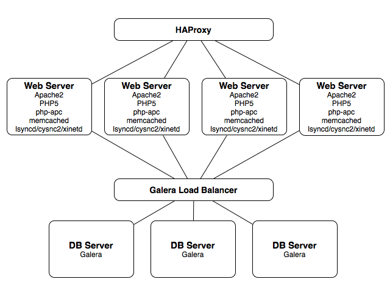

Drupal is an open source content management platform powering millions of
websites and applications. It’s built, used, and supported by an active and
diverse community of people around the world. Use Drupal to build everything
from personal blogs to enterprise applications. Thousands of add-on modules and
designs let you build any site you can imagine.

## Architecture

Our Drupal installation uses Drupal 7 installed on multiple apache2 web server
instances with PHP 5. Both APC and Memcached are installed with the necessary
Drupal plugins to effectively use. File storage synchronization between hosts
is managed with Lsyncd and Csync2. Database access is provided by a 3 server
Galera cluster for MySQL compatible databases. Haproxy provides load balancing,
SSL, and a place to attach floating IPs for external access. The entire cluster
config is managed by Salt. This application requires an image built with hooks
for Salt to run, which can be downloaded [here](http://LINK_TO_FOLLOW/).

## Performance

Our Drupal benchmarks were achieved by simulating user clicks around the
website, increasingly applying load until average response times exceed 1000ms
or the percentage of successful requests drops below 99%. For this installation,
you can expect 2800 simultaneous users can browse the website actively before
you experience degradation.

