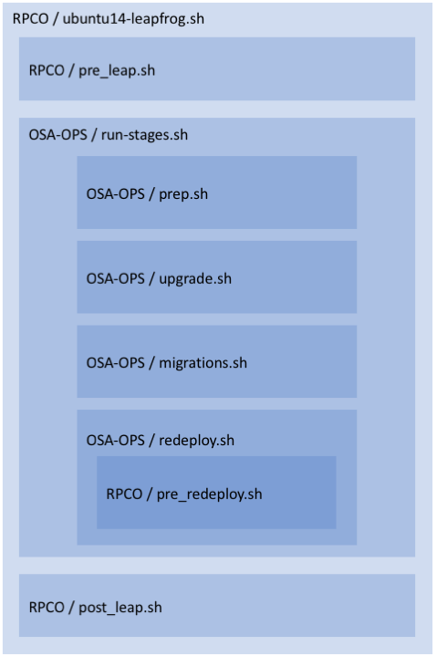

# Leapfrog Documentation

#### Overview
A Leapfrog upgrade is a major upgrade that skips at least one release. Currently
RPCO supports leapfrog upgrades from kilo to r14.1.0 (newton).

#### Terms
* [RPCO](https://github.com/rcbops/rpc-openstack): Rackspace Private Cloud powered by OpenStack
* [OSA](https://github.com/openstack/openstack-ansible):  OpenStack Ansible
* [OSA-OPS](https://github.com/openstack/openstack-ansible-ops):  OpenStack Operations
* [Kilo](https://github.com/rcbops/rpc-openstack/tree/kilo): The RPCO release of OpenStack Kilo
* [r14.1.0](https://github.com/rcbops/rpc-openstack/tree/r14.1.0): The second RPCO release of OpenStack Newton. This version includes Leapfrog upgrade tools.

## Pre Leapfrog Tasks
* Verify that the kilo deployment is healthy.
* Perform Database housekeeping to prevent unnecessary migrations.

## Executing a leapfrog upgrade

The first step is to checkout the RPC-O r14.1.0 tag. This will remove
any uncommitted information from the rpco repo, so back that up if it is
required.

```
root@kilo:/opt/rpc-openstack# git reset --hard
git clean -df
pushd openstack-ansible
git reset --hard
git clean -df
popd
git fetch origin
git checkout r14.1.0
git submodule update
git status
```

It is crucial that the rpco repo and openstack-ansible submodule are both clean
and at the appropriate SHAs for r14.1.0 at this stage. The [github
r14.1.0 tag
page](https://github.com/rcbops/rpc-openstack/tree/r14.1.0) shows both SHAs,
the RPCO SHA is the latest commit, and the OSA SHA is shown as an annotation
after @ on the openstack-ansible submodule.


The next step is to execute the leapfrog upgrade script

```
root@kilo:/rpc-openstack# scripts/leapfrog/ubuntu14-leapfrog.sh
```

## Structure of the leapfrog process.

The RPCO leapfrog scripts are a thin wrapper around OSA-OPS leapfrog tools. 

For details please refer to the scripts themselves. Paths are omitted for
brevity, scripts may not be in the root of the relevant repo.


#### Pre Leap
This step removes modifications to RPCO Kilo that aren't compatible with RPCO
Newton. Currently this only contains an Ansible 1.9 compatibility workaround.

#### Prep
This step executes pre-flight checks, and prompts the user for confirmation. It
also ensures that the databases are backed up. Backups are stored in
/openstack/backup on the physical host that houses the first galera container.

#### Upgrade
This step has a section for each major version between the source (Kilo) and
target (Newton) versions. Each section includes:
* Variable & Secrets Migration (OSA)
* Fact Cleanup
* Hostname Compatibility checks/modifications.
* Inventory Upgrades

#### Migrations
The step runs the database migrations for each major upgrade in turn.
For a RPC Kilo --> Newton upgrade this involves running the liberty,
mitaka and newton migrations in sequence.

#### Re-Deploy
This step first runs the pre_redeploy script which handles RPC variable and
secret migrations. Next the target version of OSA is deployed.
During this stage, one of the original neutron agents containers is left running
to minimise downtime.

#### Post Leap
This step deploys the RPC additions on top of the already deployed OSA.

## Rollback and Interruption
The Leapfrog upgrade is a one way process, once it has begun there is no
rollback. Once the services have been upgraded, they make changes to the
virtualisation and networking layers that would be difficult and disruptive
to reverse.

If a leapfrog upgrade is interrupted, it can be resumed. Each major step of the
leapfrog upgrade process creates a marker file, which will be used to skip
completed tasks on subsequent runs.

If a step fails information about that step will be printed along with all the
remaining steps. The operator must fix the failure before re-running the
leapfrog or completing the remaining steps manually.

## Confirmation Prompts
The leapfrog process does not run unattended, it requires the operator to
confirm at two points:
  * Near the start
    * Confirm intention
    * Check source version
  * Before deploying the target version.
    * This gives the user the opportunity to check the integrity of
      migrated rpco variables and secrets before continuing.

## Problems

#### Clone Failures
The leapfrog process includes many git clones from github, if these requests are
rate limited, tasks can fail due to timeouts. As github is beyond our control,
the only solution is to wait for rate limits to reset before retrying.

#### Galera
Occasionally the galera cluster may be in a non-functional state after the
leapfrog. If this is the case, follow the [Galera Maintenance section of the OSA
operations
guide](https://docs.openstack.org/openstack-ansible/newton/developer-docs/ops-galera-recovery.html).

#### Confirmation Prompts and the Ctrl-c warning
The confirmation prompts instruct the user not to interrupt the leapfrog process
via ctrl-c. While an uninterrupted upgrade is the smoothest, the consequences
of interruption are not as dire as implied. The process can be resumed by
re-running the top level script, which will skip the steps that have already
been completed by checking for the existence of marker files.

One of the confirmation prompts requires the operator to confirm the version that
they are upgrading from, this is compared against a detected source version.
When resuming the leapfrog process after an Interruption the files used to check
the source version may already have been upgraded, in this case the operator
will have to specify the target version (Eg Newton) when prompted for the source
version.

#### Standalone Deploy Node
If the deploy node (host that the top level leapfrog script is run from) is not
one of the openstack infrastructure (api) nodes, then python-mysql may fail to
install. If this happens, then `libmysqlclient-dev` must be installed
before retrying:

```
apt-get install libmysqlclient-dev
```
This issue is being tracked as [LA-342](https://rpc-openstack.atlassian.net/browse/LA-342).
